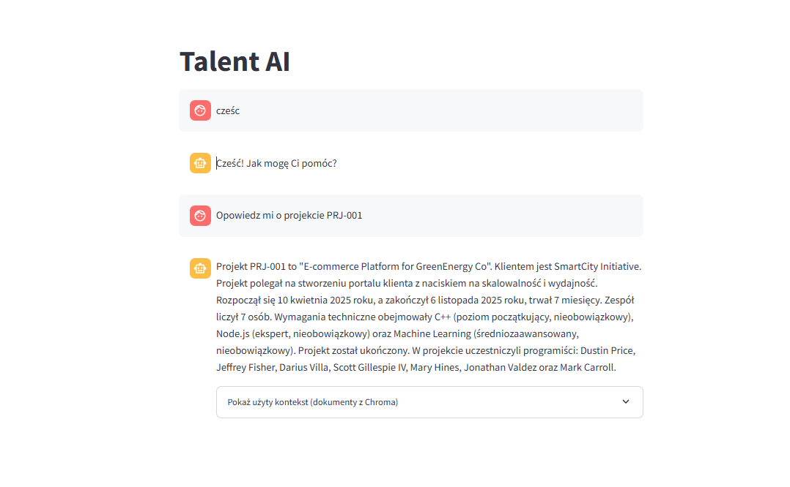

# TEG_proj
## Skrypt generate_data -> katalog generate_data
Służy do generowania cv programistów, rfps i pliku projects.json z obecnie toczącymi się projektami.  

Pliki sa generowane do katalgu /data w gałęzi głownej

Uruchomienie:  

generate_data_docker_example.yml zmień na generate_data_docker.yml

uzupełnij OPENAI_API_KEY w generate_data_docker.yml 

będąc w katalogu głownym:

docker compose -f generate_data_docker.yml build 

docker compose -f generate_data_docker.yml up

Istniejące dane zostaną usunięte

## Skrypt create_chroma -> katalog create_dbs
Służy do stworzenia chromadb na podstawie cv programistów i pliku projects.json z obecnie toczącymi się projektami.  

Wymaga odpalenia generate_data.  

Pliki sa generowane do katalgu /data w gałęzi głownej.  

Uruchomienie:  

create_dbs_docker_example.yml zmień na create_dbs_docker.yml

uzupełnij OPENAI_API_KEY w create_dbs_docker.yml 

będąc w katalogu głownym:

docker compose -f create_dbs_docker.yml build 

docker compose -f create_dbs_docker.yml up

Istniejąca chromadb zostaną usunięte

## Aplikacja

Backend wystawia post /ask_rag do odpytywania się rag pochodzącego z chromadb.  

Backend wystawia post /add_rfp do dodawania nowege /add_rfp do chromadb.  

Frontend wystawia proste GUI wysyła zapytanie do backend za pomocą /ask_rag oraz umożliwia wysyłanie nowego rfp.

Wymaga odpalenia generate_data i create_chroma.  

Uruchomienie:  

talent_ai_docker_example.yml zmień na talent_ai_docker.yml

uzupełnij OPENAI_API_KEY w talent_ai_docker.yml 

będąc w katalogu głownym:

docker compose -f talent_ai_docker.yml build 

docker compose -f talent_ai_docker.yml up

http://localhost:8501/

