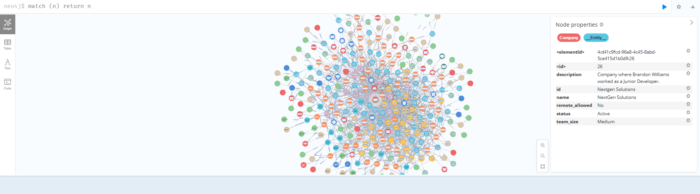

# TEG_proj
## Skrypt generate_data -> katalog generate_data
Służy do generowania cv programistów, rfps i pliku projects.json z obecnie toczącymi się projektami.  

Pliki sa generowane do katalgu /data w gałęzi głownej

Uruchomienie:  

generate_data_docker_example.yml zmień na generate_data_docker.yml

uzupełnij OPENAI_API_KEY w generate_data_docker.yml 

będąc w katalogu głownym:

docker compose -f generate_data_docker.yml build 

docker compose -f generate_data_docker.yml up

Istniejące dane zostaną usunięte

## Skrypy create_chroma i create_graph -> katalog create_dbs
Skrypt create_chroma służy do stworzenia chromadb na podstawie cv programistów i pliku projects.json z obecnie toczącymi się projektami.  

Skrypt create_graph służy do stworzenia grafu neo4j na podstawie cv programistów i pliku projects.json z obecnie toczącymi się projektami.

Wymaga danych z generate_data (katalog data -> tam to powinno być).  

Pliki sa generowane do katalgu /data w gałęzi głownej.  

Uruchomienie:  

create_dbs_docker_example.yml zmień na create_dbs_docker.yml

uzupełnij OPENAI_API_KEY w create_dbs_docker.yml 

będąc w katalogu głownym:

docker compose -f create_dbs_docker.yml build 

docker compose -f create_dbs_docker.yml up

Istniejąca chromadb zostaną usunięte

Genracja grafu potrafi zając jakieś 20-25 minut.  

http://localhost:7474/browser/  

## Aplikacja

Backend wystawia post /ask_rag do odpytywania się rag pochodzącego z chromadb.  

Backend wystawia post /ask_graph do odpytywania się grafu.  

Backend wystawia post /add_rfp do dodawania nowego rfp do chromadb i do grafu.  

Frontend wystawia proste GUI i wysyła zapytanie do backend za pomocą /ask_rag i /ask_graph oraz umożliwia wysyłanie nowego rfp.

Wymaga danych z create_chroma i create_graph.

Uruchomienie:  

talent_ai_docker_example.yml zmień na talent_ai_docker.yml

uzupełnij OPENAI_API_KEY w talent_ai_docker.yml 

będąc w katalogu głownym:

docker compose -f talent_ai_docker.yml build 

docker compose -f talent_ai_docker.yml up

http://localhost:8501/

